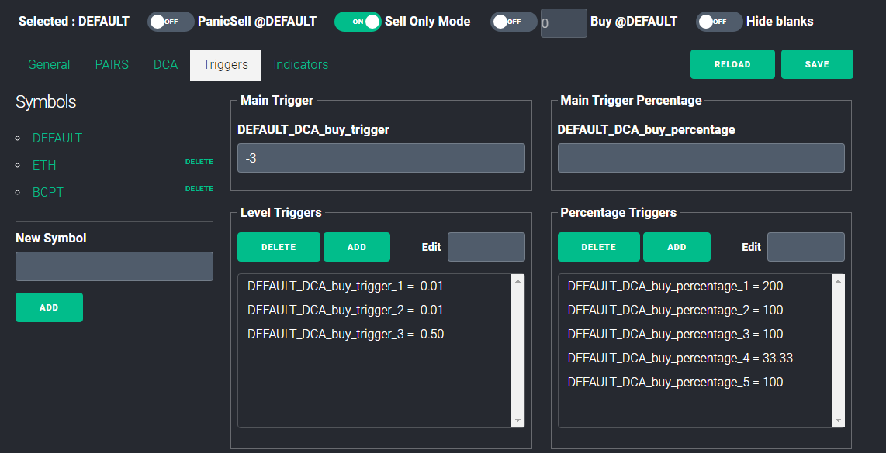
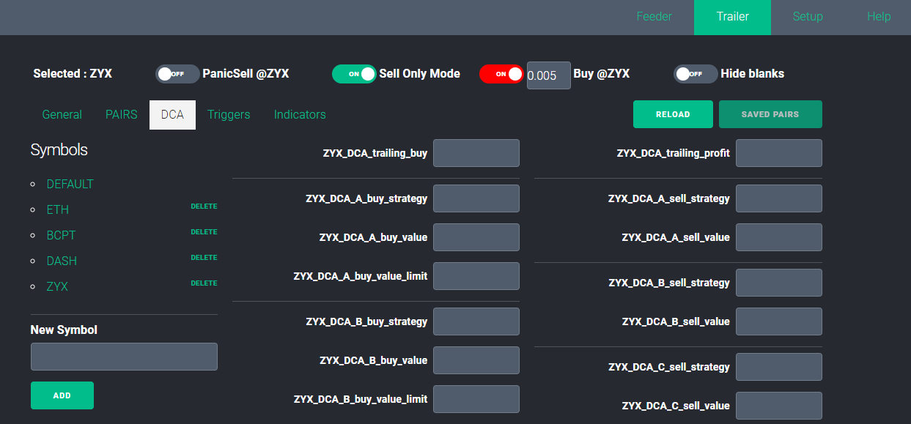

# Profit-Pilot

Hello, welcome to ProfitPilot!

I created this application because I really like using Profit Trailer. Also Feeder and Magic! ProfitPilot automates and enhances a lot of the combined power of the applications. It is a PT Feeder GUI, enhanced PTrailer GUI, and has many functions, such as automatically translating your Trailer settings directly to Feeder, or monitoring Feeder settings in the GUI as feeder does it’s work live! It also has manual buy & sell, and auto transfer your BTC/ETH profits to TUSD. It makes confguring separate coins easy! It also works with PT Magic!

&nbsp;

<strong>What is Profit Pilot?</strong>

An Enhanced Feeder GUI (Graphical User Interface) 

An Enhanced Trailer GUI (Graphical User Interface) 

Works with ProfitTrailer-Feeder, or ProfitTrailer-Magic, or ProfitTrailer Only

And much more!

&nbsp;

<strong>HOW TO INSTALL</strong>

   Visit the site to<a href="http://digitaltradingsoftware.com"> buy and install it</a>.

<strong>HELP</strong>

   Check the WIKI for instructions.

<strong>COMMUNITY</strong>

  TELEGRAM: (coming soon)

  DISCORD: (coming soon)

&nbsp;

&nbsp;

&nbsp;

&nbsp;

&nbsp;
 
