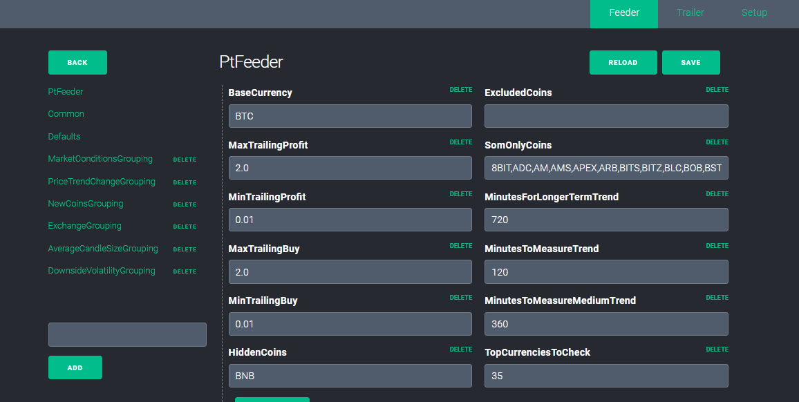
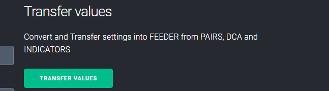

# Profit-Pilot

Hello, welcome to ProfitPilot!

I created this application because I really like using Profit Trailer. Also Feeder and Magic! ProfitPilot automates and enhances a lot of the combined power of the applications. It has a PT Feeder GUI, and also a ProfitTrailer GUI, which combined the two! It has many functions such as automatically translating your Trailer settings directly to Feeder! It also has manual buy & sell & manual DCA. 
 It can transfer your BTC or ETH profits to USDT or fiat when the market drops(Pro Version). It makes confguring separate coins easy! 

&nbsp;

<strong>What does Profit Pilot? add-on do?</strong>

Works with ProfitTrailer or Feeder or Magic, or without Feeder or Magic. You do not have to get both.

Automatically saves settings to ProfitTrailer.

No typing ProfitTrailer commands.

PT Feeder user screen. (can also use PT Magic) 

Monitor what Feeder is doing to Trailer.

Manual Buy and Sell in ProfitTrailer. Manual DCA also.

Automatically transfer any PT settings into your Feeder file.

Easily configure separate coins instead of DEFAULT.

Can connect to remote web interface and access smartphone.

And much more!

&nbsp;

<strong>HOW TO INSTALL</strong>

   Visit the site to<a href="http://digitaltradingsoftware.com"> buy and install it</a>.

<strong>HELP</strong>

   Check the <a href="https://github.com/themightycrypto/Profit-Pilot/wiki">WIKI</a> for instructions.

  TELEGRAM: @theMightyCrypto <a href="telegram.me/themightycrypto">telegram.me/theMightyCrypto</a>

  DISCORD: (coming soon)

&nbsp;

&nbsp;

&nbsp;

&nbsp;
&nbsp;

&nbsp;
 
